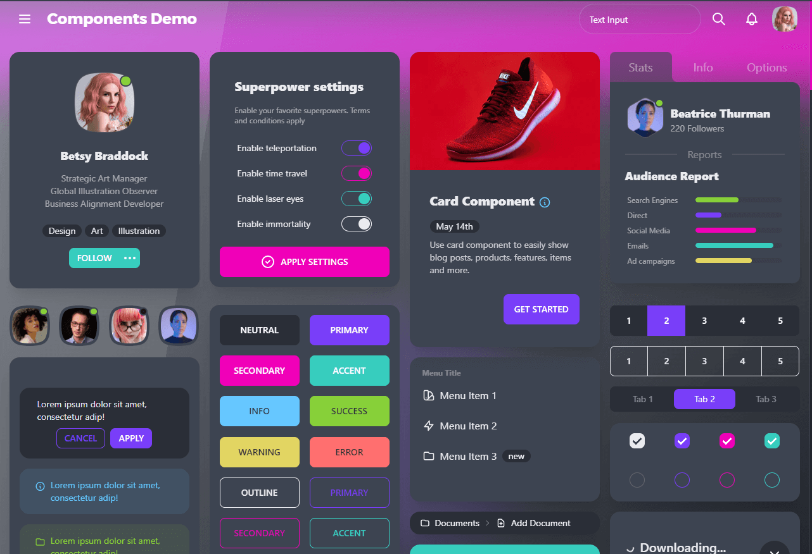
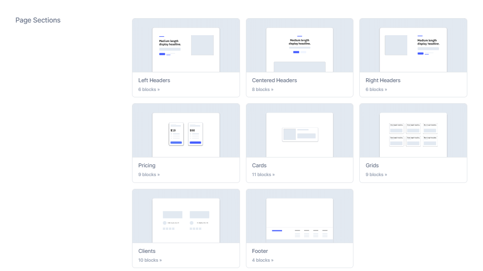
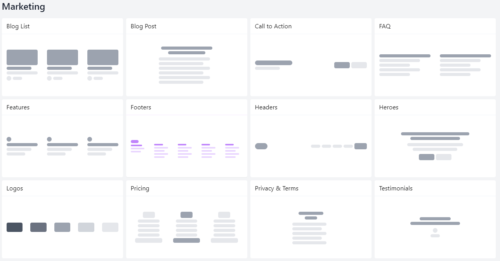
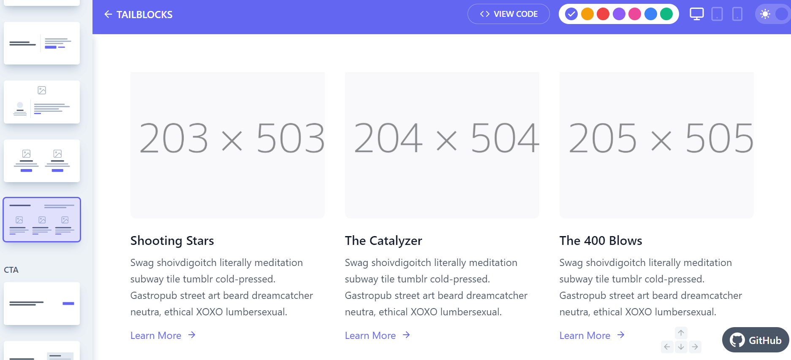
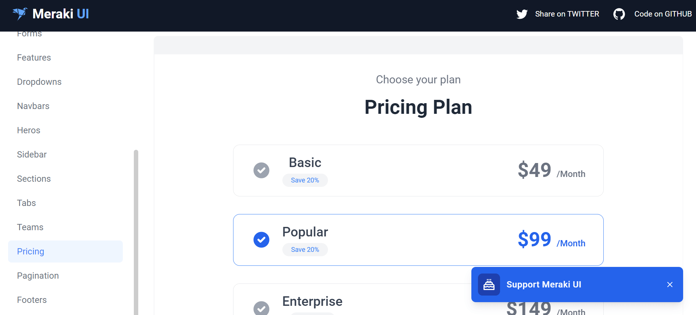
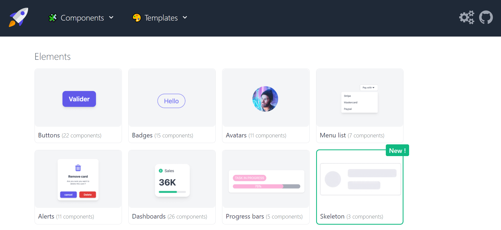
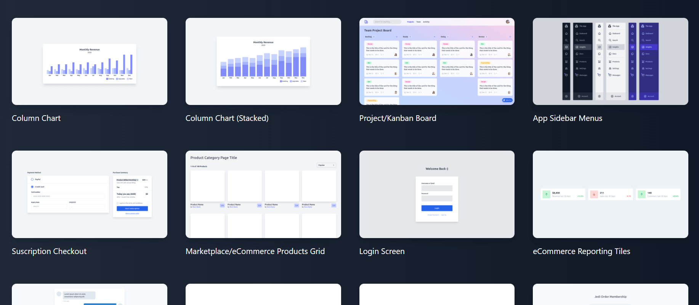
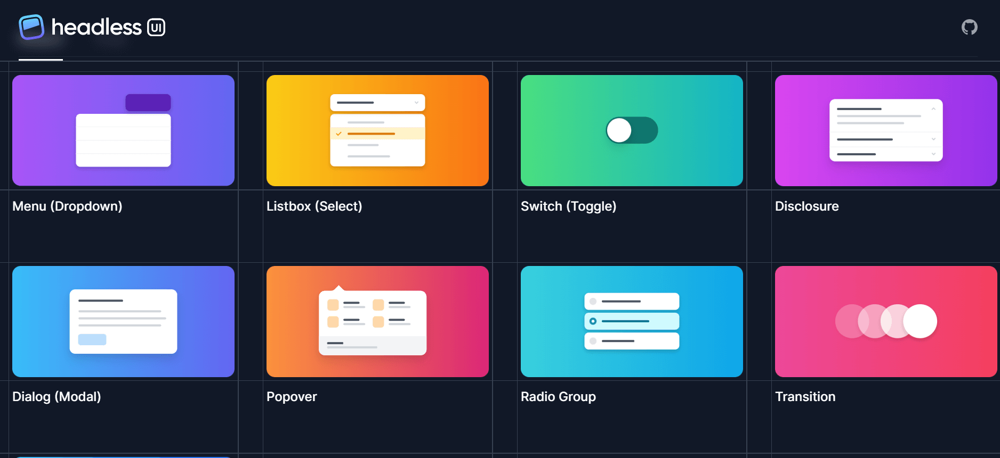

Stop re-inventing the wheel and build your website faster with these ready-to-use UI components built with TailwindCSS. Actually, the website you're browsing right now is built with the help of these components. But that's another story! Now let's jump in and explore these awesome websites

## 1. Daisy UI

This one does have really nice "micro" components like buttons, menus, avatar, etc... And it's not plug-and-play, meaning you need to install the library to use it.

<a href="https://daisyui.com/" target="_blank">
  https://daisyui.com/
</a>

## 2. Wickedblocks

Wickedblocks has a wider variety of layout and content components. From Navigation to footer, you can find most components used in marketing websites like Pricing, Clients, Grids, etc...

<a href="https://wickedblocks.dev/" target="_blank">
  https://wickedblocks.dev/
</a>

## 3. Kutty

It's just like Wickedblocks but with another style and probably more components. You can choose any component, copy HTML and paste in your website. It's plug and play!

<a href="https://kutty.netlify.app/components/" target="_blank">
  https://kutty.netlify.app/components/
</a>

## 4. Tailblocks

Both navigation and footer components in my website are actually from Tailblocks. It's just like previous two websites but with additional components. So if you didn't find your desired component in Kutty or Wickedblocks, you'll probably find it here!

<a href="https://tailblocks.cc/" target="_blank">
  https://tailblocks.cc/
</a>

## 5. Meraki UI

No, this's not the pricing plan for Meraki. Meraki is actually both free & open-source. This's a nice pricing plans component from Meraki that you can use for your SaaS landing page or marketing site!

<a href="https://merakiui.com/" target="_blank">
  https://merakiui.com/
</a>

## 6. Tailwind UI KIT

This one includes less component, but it has components that you'll not find in the previous websites, like tables, lists, profiles and even shopping cards!

<a href="https://www.tailwind-kit.com/components" target="_blank">
  https://www.tailwind-kit.com/components
</a>

## 7. Lofi UI

This one has a even more components. It also has full layouts for dashboards! You can even find entire Slack UI there if you want to use it for your application. Use this one if you can't make layout decisions in your website.

<a href="https://lofiui.co/" target="_blank">
  https://lofiui.co/
</a>

## 8. Headless UI

This one is actually made by TailwindCSS team itself. But it has way less components that the other websites. This is a huge turn off but you might like some compnents from there! It's also not plug-and-play, you've to install the library to use it.

<a href="https://headlessui.dev/" target="_blank">
  https://headlessui.dev/
</a>

## And finally, how do I use these HTML components in JSX?

head to [HTML to JSX](https://magic.reactjs.net/htmltojsx.htm) where you can convert HTML to CSS effortlessly with one click!
