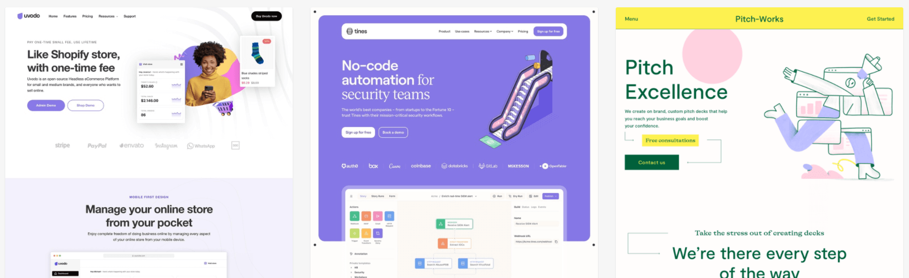
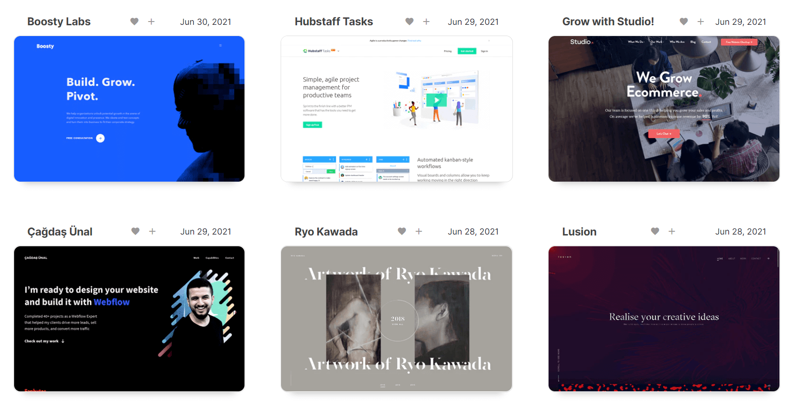
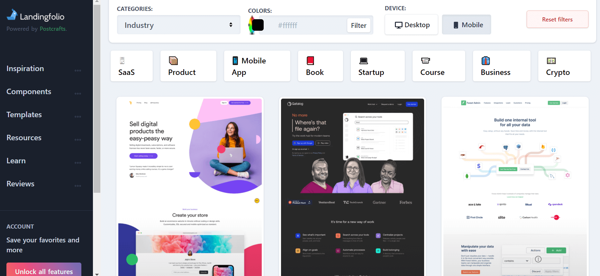
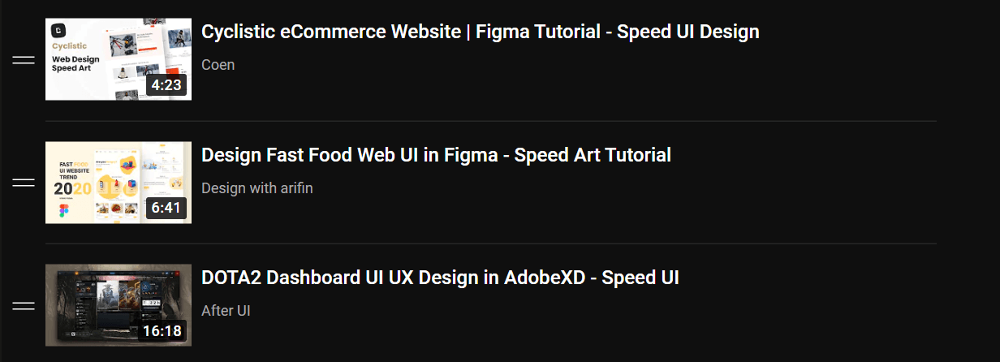
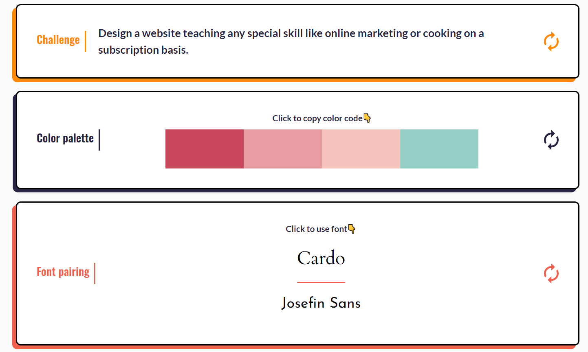

You probably came here because you suck at design, just as myself. As a developer, wouldn't it be nice if you can build better apps/websites without the help of a specializaed UI/UX designer? You don't need to study a whole new profession like design. You just need the fundamentals and inspiration then you're good to go. In this article, I'll share with you some tips to develop an eye for design.

## Step 1: Find inspiration.

You can do this with the help of some websites that I'll recommend to you. You'll not see Dribble or Awwwards here but I'll point you to less popular websites that have real websites that are already coded and deployed to production. So you can inspect and study them carefully.



### land-book

<a href="https://land-book.com/" target="_blank">
  https://land-book.com/
</a>

<div class="py-6"></div>



### webdesign-inspiration

<a href="https://www.webdesign-inspiration.com/" target="_blank">
  https://www.webdesign-inspiration.com/
</a>

<div class="py-6"></div>



### Landingfolio

This one is my favoutie, because it has a lot of categorizations and filters that help me when I need inspiration for a particular kind of a website or a particular section. You can even search by colors!

<a href="https://landingfolio.com/" target="_blank">
  https://landingfolio.com/
</a>

<div class="py-6"></div>

I also recommend looking at magazines and inspect their layout decisions. Which are ofen great and can be copied in websites.

Another trick that I find useful, is to watch speed UI design YouTube videos. This will make you pay more attention to details and be watch the whole process of designing the website. You can start with my playlist:



<a
  href="https://www.youtube.com/playlist?list=PL2OSi-cbBazn3KSkzZF7tv2tFgpzOLD-v"
  target="_blank"
>
  https://www.youtube.com/playlist?list=PL2OSi-cbBazn3KSkzZF7tv2tFgpzOLD-v
</a>

## Step 2: Study your inspiration.

By this, I mean:

#### Look for decisions you wouldn’t have made

> Whenever you stumble across a design you really like, ask yourself: “Did the designer do anything here that I never would have thought to do?”
> -- Book: Refactoring UI

#### Break down the design

Whenever you stumble across a design you really like, take a few minutes to analyze the color pallette, typograghy, layout decision. You can use dev tools to "inspect element" and see exactly how this really nice font -for example- is made. Sometimes you'll see a shadow that looks way better than the typical shadow you can make with

```css
/* this shadow is nice by the way */
box-shadow: rgba(149, 157, 165, 0.2) 0px 8px 24px;
```

inspect that shadow and see how it's made, or even better, steal it for your website!

> Good artists copy, Great artists steal

#### Pay attenion to details

Details can make the difference between a good design and a gap one. Those details make you think of a website design as polished. Pay attention to details of other people designs. Something like a rounded corner here or a larger font there can have a huge impact on how polished a design looks.

## Step 3: Practice

This one is a bit intuitive. You can't just stare at designs all day and hope that you'll be able to build better websites. Open a new Figma file and start practising what you've learned. You can start by immitating good designs that inspire you. If you want to build something from scratch, use this website to generate challenges for you so you don't have to worry about the idea!

<a href="https://uicoach.io/generator" target="_blank">
  https://uicoach.io/generator
</a>


