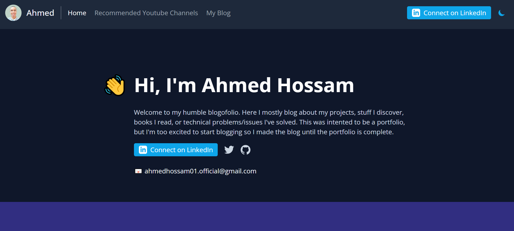

🤩 I'm more than excited to announce that my personal website is now complete and was already published 1 month ago at https://www.ahmedhossam.me/ 🚀🚀

This is an essential tool for my job hunting that's about to start. "A strong online presence allows you to build your brand and credibility. It provides a way for people to find your work easily."

It has been a long journey since I started learning Front-end development in April 2018. Back then, I published my first post in a development group asking for help to center a div! I ended up diving into the fundamentals of computer science, practicing DSA, and learning Back-End development while focusing on Front-End. By the end of 2020, I started freelancing on Freelancer.com and got amazing reviews! Then after a year of no activity (last year in high school), I started again doing freelance gigs on Upwork because I finally turned 18 and was able to create an account there. And now I decided to prepare for my job hunt to land a full-time remote position and I build a large project `bug-tracker` that took me around 40 hours to complete, with the purpose of demonstrating my skillset and ability to build a complete web app that is usable from a user's standpoint. But that's a story for another post!

